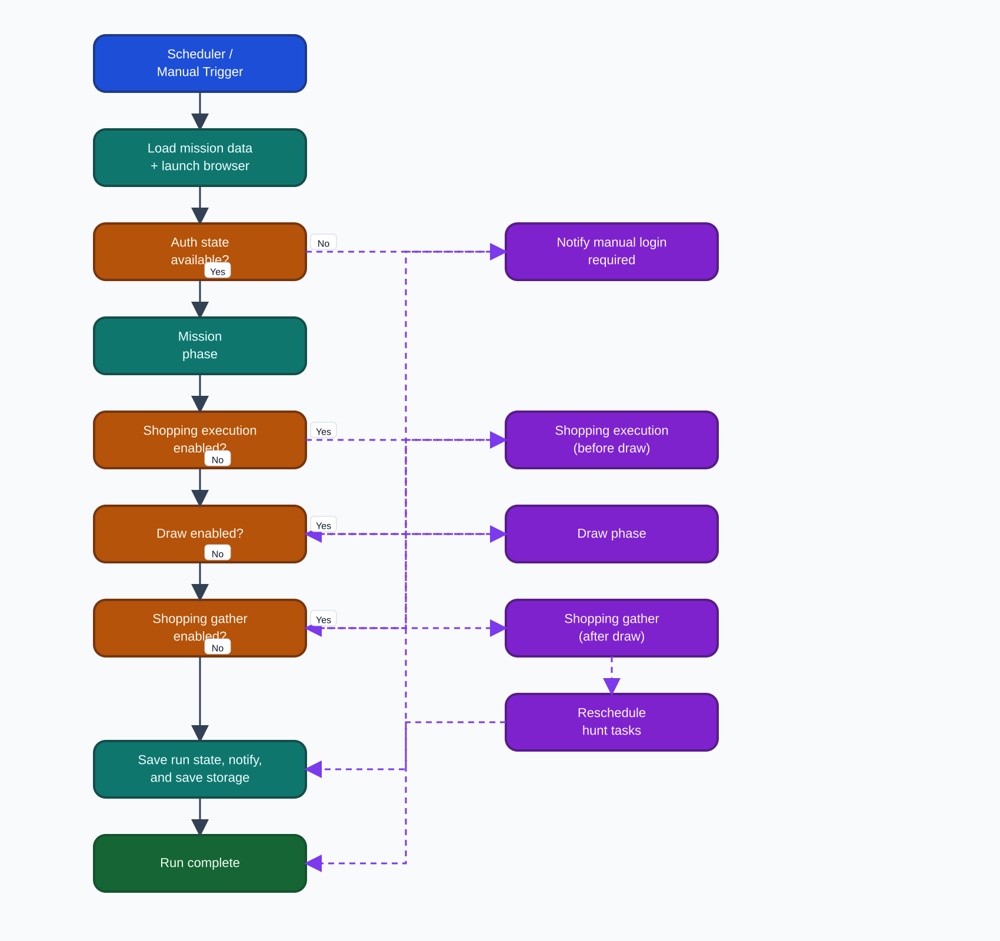

# ZZZ Bot

ZZZ Bot is a desktop automation app for **Zenless Zone Zero** HoYoLab workflows. It helps you automate daily tasks,
manage shopping priorities, monitor hunts, and track logs in one UI.

## What It Automates

- Daily HoYoLab check-in and mission workflow
- Event shop data collection and item exchange flow
- Optional draw execution
- Redemption code tracking and status updates

## Automation Flow Diagram

The diagram below shows the scheduler-driven run path, including optional branches for shopping execution, draw, and
shopping data gathering.

## In-App Features

### Overview

- Shows the latest mission report and mission completion states
- Displays hunt mode status, hunted items, and next hunt schedule
- Shows last run and next scheduled run times

### Shopping

- Displays event shop items with price, inventory, and availability
- Lets you select items to exchange and set item priority
- Lets you mark selected items for **Hunt mode**
- Highlights purchased items for quick review

### Redeem

- Displays saved redemption entries (item, code, date, state)
- Lets you mark entries as completed
- Saves updated redemption states

### Account

- Stores HoYo account credentials used by automation flows
- Stores notification credentials for alerts

### Manual Login

- Starts a manual browser session when login or session recovery is needed
- Supports stop control from the UI
- Tracks current browser session state

### Logs

- Shows parsed runtime logs in-app
- Filters by log file/date, severity, and search text
- Supports pagination and optional auto-refresh

### Settings

- Configure daily schedule times
- Toggle automation behavior for mission, shopping, draw, and hunt mode
- Tune hunt polling behavior (wait time, interval, backoff, early exit)
- Toggle browser visibility and exit-after-run behavior
- Switch UI themes (Nebula, Venom, Glacier, Cyber)
- Configure runtime monitoring options and local cleanup action
- Toggle desktop auto-start (in desktop runtime)

## Scheduling and Hunt Behavior

- Runs tasks automatically at configured schedule times
- Handles missed scheduled runs when possible
- Hunt mode schedules item checks based on item return timing with a buffer
- Hunt scheduling updates when shopping data changes

## Notifications and Monitoring

- Desktop notification when a run finishes
- Optional notification delivery using configured account settings
- Optional runtime monitoring configuration (including trace/profile sample rates)

## Data Persistence

The app keeps user settings and run-related data between sessions, including:

- App settings
- Account/notification credentials
- Shopping selections and hunt targets
- Redemption list state
- Mission and run status history

## Scope and Limitations

- Focused on Zenless Zone Zero HoYoLab event and redemption workflows
- Requires valid account/session context for automation to work
- Automation reliability depends on target web page structure and availability
