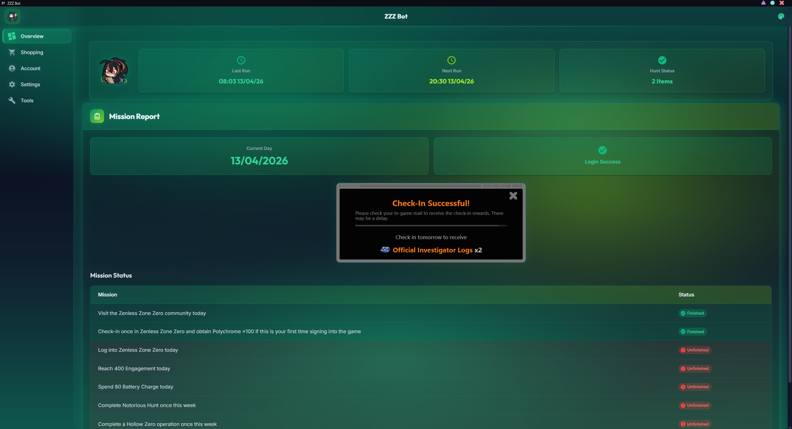
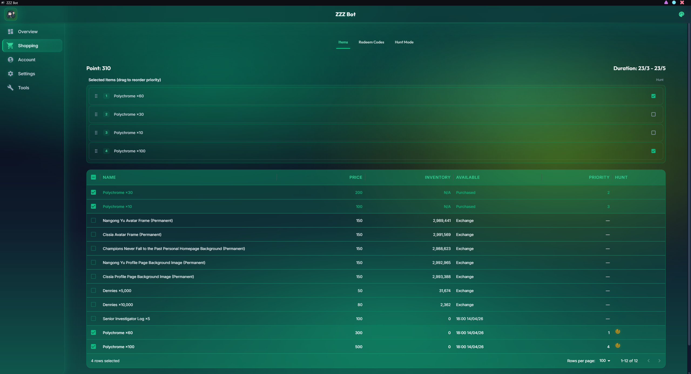
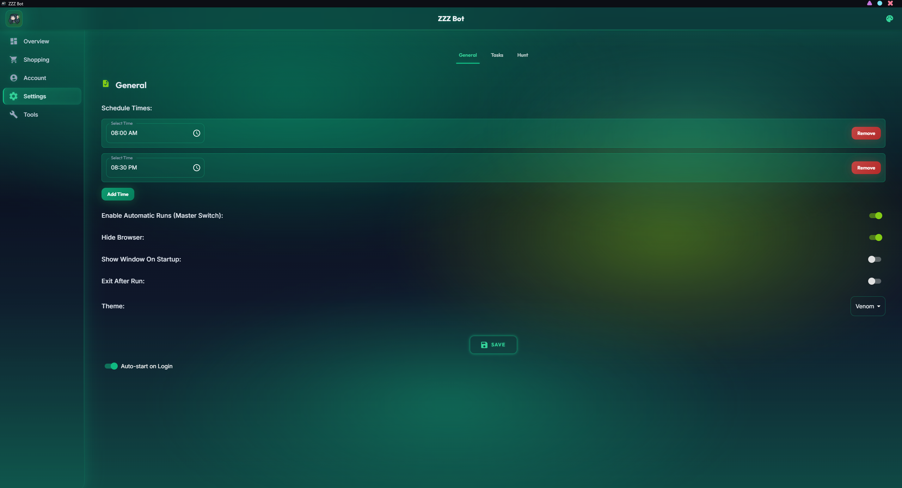
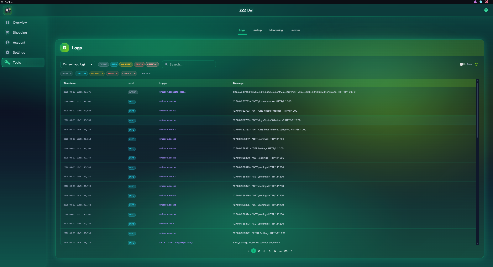

# ZZZ Bot

**Unofficial** desktop automation tool for **Zenless Zone Zero** HoYoLab workflows. Automates daily tasks, manages
shopping priorities, monitors hunts, and centralizes logs in a single UI. Not affiliated with or endorsed by HoYoverse,
miHoYo, or Cognosphere.

> Documentation lives in [`obsidian/`](./obsidian/_HOME.md) — open as an Obsidian vault, or browse the markdown directly.

## What It Automates

- Daily HoYoLab check-in and mission workflow
- Event shop data collection and item exchange flow
- Optional prize-draw / lucky-draw reward collection
- HoYoLab redemption-code tracking and status updates

## Screenshots

| Overview | Shopping |
|---|---|
|  |  |

| Settings | Logs |
|---|---|
|  |  |

## Automation Flow

The diagram below shows the scheduler-driven run path, including optional branches for shopping execution, draw, and
shopping data gathering. Hunt-mode execution runs on a **separate** schedule and is not part of this flow.

```mermaid
%%{init: {'theme':'base','themeVariables':{
  'primaryColor':'#1e293b','primaryTextColor':'#f1f5f9','primaryBorderColor':'#64748b',
  'lineColor':'#94a3b8','secondaryColor':'#334155','tertiaryColor':'#0f172a',
  'fontFamily':'Segoe UI, Arial, sans-serif'}}}%%
flowchart TD
    start([Scheduler / Manual trigger]):::startEnd
    load[Load mission data<br/>+ launch browser]:::proc
    auth{Auth state<br/>available?}:::decision
    manual[/Notify manual login<br/>exit early/]:::optional
    mission[Mission phase<br/><i>always runs</i>]:::proc

    shopExecDecide{<code>gather_shopping_data</code><br/>AND <code>exchange_good</code>?}:::decision
    shopExec[Shopping execution<br/><b>Phase 1</b> — before draw]:::optional

    drawDecide{<code>draw_item</code>?}:::decision
    draw[Draw phase]:::optional

    gatherDecide{<code>gather_shopping_data</code>?}:::decision
    gather[Shopping gather<br/><b>Phase 2</b> — after draw]:::optional
    gatherOk{Gather<br/>succeeded?}:::decision
    hunt[Reschedule hunt tasks]:::optional

    saveRun[save_last_run]:::proc
    emit[Emit <code>task-completed</code>]:::proc
    notify[Desktop notification]:::proc
    saveStorage[Save storage state]:::proc
    done([Run complete — browser close]):::startEnd

    start --> load --> auth
    auth -- No --> manual --> done
    auth -- Yes --> mission --> shopExecDecide

    shopExecDecide -- Yes --> shopExec --> drawDecide
    shopExecDecide -- No --> drawDecide

    drawDecide -- Yes --> draw --> gatherDecide
    drawDecide -- No --> gatherDecide

    gatherDecide -- Yes --> gather --> gatherOk
    gatherDecide -- No --> saveRun
    gatherOk -- Yes --> hunt --> saveRun
    gatherOk -- No --> saveRun

    saveRun --> emit --> notify --> saveStorage --> done

    classDef startEnd fill:#1d4ed8,stroke:#1e3a8a,stroke-width:2px,color:#ffffff;
    classDef proc fill:#0f766e,stroke:#134e4a,stroke-width:2px,color:#ecfeff;
    classDef decision fill:#b45309,stroke:#78350f,stroke-width:2px,color:#fff7ed;
    classDef optional fill:#7e22ce,stroke:#581c87,stroke-width:2px,color:#faf5ff,stroke-dasharray: 5 4;
```



## Installation (Windows)

ZZZ Bot stores all data in an embedded **SQLite** database — there is **no separate database
to install**. The database file is created automatically on first launch under `data/` and
persists across app updates.

### 1. Install ZZZ Bot

1. Download the latest `.exe` installer from the repository's **Releases** page.
2. Run the installer and follow the NSIS wizard.
3. Launch **ZZZ Bot** from the Start menu or desktop shortcut.

### 2. First-run setup

1. Open **Manual Login** from the app and sign in to HoYoLab — the session is saved for future automated runs.
2. Open **Account** to enter notification credentials (optional).
3. Adjust schedule and per-task toggles under **Settings**.

### Upgrading from a MongoDB-based version

Earlier releases stored data in a local MongoDB instance. If you are upgrading and want to
keep that data:

1. Make sure your existing MongoDB is still running on `mongodb://localhost:27017`.
2. Launch the new ZZZ Bot, open **Backup** → **Maintenance** → **Migrate from MongoDB**.
3. The card reports per-collection counts; settings, account, and shopping hot-load into
   the running app without a restart.

Afterwards MongoDB is no longer used and can be uninstalled.

The same migration is available as a CLI script for headless / scripted use:

```powershell
uv run python backend/utils/migrate_mongo_to_sqlite.py
```

### Troubleshooting

- **Manual login keeps being required** — your HoYoLab session may have expired; re-run Manual Login.

## In-App Features

### Overview

- Latest mission report and per-mission completion state
- Hunt mode status, hunted items, and next scheduled hunt
- Last run and next scheduled run times

### Shopping

- Event shop items with price, inventory, and availability
- Item selection with priority ordering
- Mark selected items for **Hunt mode**
- Highlights purchased items for quick review

### Redeem

- Saved redemption entries (item, code, date, state)
- Mark entries as completed and persist the updated state

### Account

- HoYo account credentials used by automation flows
- Notification credentials for alerts

### Manual Login

- Launch a manual browser session for login or session recovery
- Stop control from the UI
- Current browser session state

### Logs

- Parsed runtime logs in-app
- Filter by log file/date, severity, and search text
- Pagination and optional auto-refresh

### Settings

- Daily schedule times
- Per-task toggles: mission, shopping, draw, hunt mode
- Hunt polling tuning (wait time, interval, backoff, early exit)
- Browser visibility and exit-after-run
- UI themes: Nebula, Venom, Glacier, Cyber
- Runtime monitoring options and local cleanup action
- Desktop auto-start (in desktop runtime)

## Scheduling and Hunt Behavior

- Runs tasks at configured schedule times
- Handles missed scheduled runs when possible
- Hunt mode schedules item checks against item return timing with a buffer
- Hunt scheduling updates when shopping data changes

## Notifications and Monitoring

- Desktop notification when a run finishes
- Optional notification delivery using configured account settings
- Optional runtime monitoring (including trace/profile sample rates)

## Data Persistence

User settings and run-related data persist between sessions:

- App settings
- Account / notification credentials
- Shopping selections and hunt targets
- Redemption list state
- Mission and run status history

## Scope and Limitations

- Focused on Zenless Zone Zero HoYoLab event and redemption workflows
- Requires valid account/session context for automation to work
- Automation reliability depends on target web page structure and availability

## Project Documentation

Contributors should start with [`CLAUDE.md`](CLAUDE.md) for an overview of modules, endpoints, and key conventions,
then see the rule files under `.claude/rules/`:
[`architecture.md`](.claude/rules/architecture.md),
[`code-guide.md`](.claude/rules/code-guide.md), and
[`documentation-style.md`](.claude/rules/documentation-style.md).

## Disclaimer

This is an unofficial community project. It is not affiliated with, endorsed by, or sponsored by HoYoverse, miHoYo, or
Cognosphere. Automating interactions with HoYoLab may violate its Terms of Service; use at your own risk. The authors
accept no responsibility for account actions, bans, lost rewards, or any other consequences of using this tool.

## License

Copyright (C) 2026 Fly

This project is licensed under the **GNU General Public License v3.0** — see the [LICENSE](LICENSE) file for the full
text. You are free to use, modify, and redistribute this software under the terms of the GPL-3.0, which requires that
any derivative works also be licensed under GPL-3.0 and their source code made available.

This program is distributed in the hope that it will be useful, but WITHOUT ANY WARRANTY; without even the implied
warranty of MERCHANTABILITY or FITNESS FOR A PARTICULAR PURPOSE.
