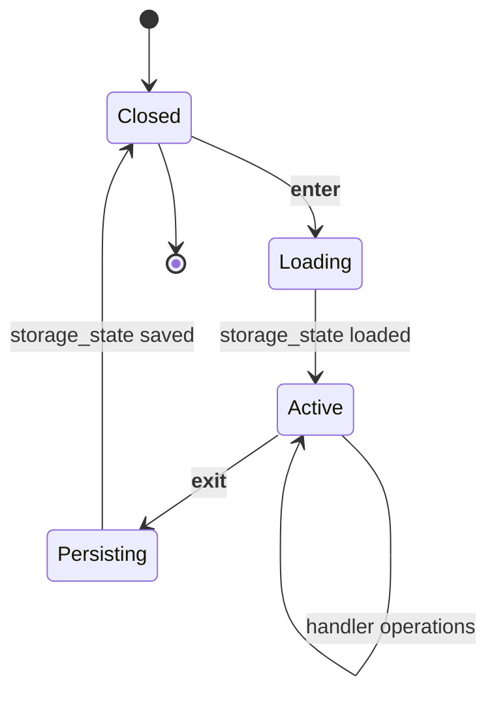

# Browser Session Lifecycle

> A single Playwright Firefox session shared across all handlers in one
> [[Daily Task Cycle]]. Auth state lives on disk in `authentication data/`; the session
> loads it on enter and persists changes on exit.

## Source

- `backend/services/BrowserService.py` — `create_browser_session()` context manager
- `backend/utils/storage_state_store.py` — load/save Playwright storage state

## How it works

The context manager:
1. Spawns Firefox via Playwright with `hide_browser`-controlled headless flag.
2. Loads `authentication data/storage_state.json` if present (skips otherwise — first run).
3. Yields a `(browser, context, page)` triple to the caller.
4. On exit, calls `context.storage_state(path=...)` so cookies + localStorage survive.

## Depends on

- [[BrowserService]] — the context manager itself
- [[Storage State Store]] — JSON serialization of cookies/localStorage
- [[Playwright]] — runtime
- [[Manual Login Flow]] — produces the initial storage state via user-driven login

## Used by

- [[Daily Task Cycle]] — wraps every scheduled run
- [[Hunt Mode Lifecycle]] — opens its own session per hunt poll

## Gotchas

- Two simultaneous sessions are NOT supported — they share the same storage_state file and the second writer wins.
- Firefox is bundled inside the PyInstaller sidecar (`playwright-browsers/firefox-*`); the host system does not need Firefox installed in production. See [[PyInstaller Sidecar Build]].

## See also

- [[_index]]
- [[Manual Login Flow]]
- [[Daily Task Cycle]]
- [[Playwright]]
