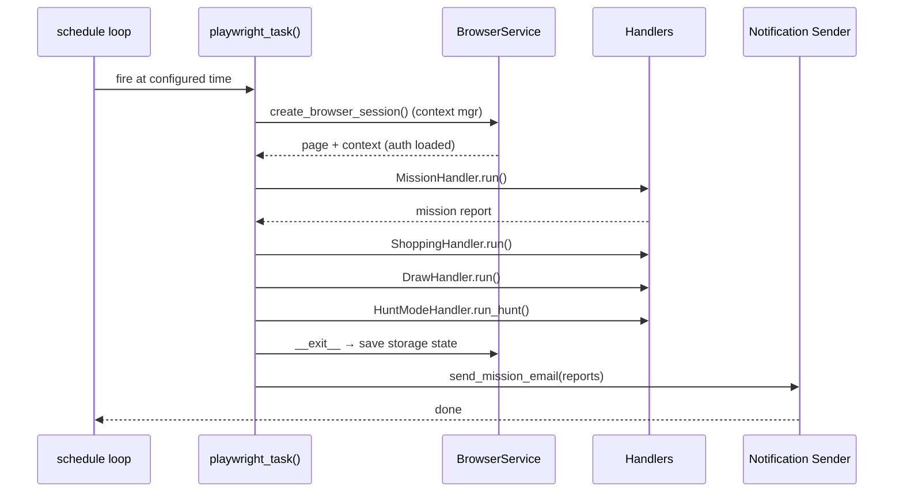

# Daily Task Cycle

> The top-level scheduled run: `schedule` library fires `playwright_task()` at each
> configured time, which orchestrates Mission → Shopping → Draw → Hunt handlers inside
> a single shared Playwright session and sends one summary email.

## Source

- `backend/Bot.py` — `playwright_task()` orchestration + scheduler setup
- `backend/core/GlobalVar.py` — `CONFIG.schedule_times` driving the schedule

## How it works

`schedule_times` defaults to `["08:00", "20:00"]`. Each tick runs everything inside one
session so authentication, browser warmup, and network state are paid once.
[[Hunt Mode Lifecycle]] is the only handler that may also run *outside* this cycle when
its scheduled stock-poll fires.

## Depends on

- [[Bot Entry Point]] — schedules and invokes `playwright_task()`
- [[BrowserService]] — provides the session context manager
- [[MissionHandler]], [[ShoppingHandler]], [[DrawHandler]], [[HuntModeHandler]] — the four handlers
- [[Notification Sender]] — final email

## Used by

- [[Sidecar Lifecycle]] — the scheduler runs inside the sidecar process

## Gotchas

- `exit_after_run: true` in settings causes Bot.py to terminate after the email is sent — used when the Tauri shell's "Exit After Run" tray flag is set.
- A second tick can fire while the first is still running on slow networks; handlers are not re-entrant.

## See also

- [[_index]]
- [[Hunt Mode Lifecycle]]
- [[Sidecar Lifecycle]]
- [[Schedule]]
