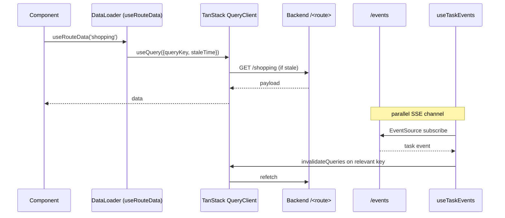

# Frontend Data Flow

> The React app reads backend state via TanStack Query (wrapped in `DataLoader`) and
> receives real-time updates via Server-Sent Events (`useTaskEvents`). All mutations
> invalidate related queries to keep the cache honest.

## Source

- `frontend/src/services/DataLoader.jsx` — query + mutation factories
- `frontend/src/hooks/useTaskEvents.js` — SSE listener
- `frontend/src/config/constants.js` — `STALE_TIMES` per route

## How it works

`useSaveData(route)` mutations call `POST /api/{route}` and auto-invalidate related
keys (e.g., `backup/import` invalidates `settings`, `account`, `shopping`,
`overview/mission`). Edit-style pages wrap `useSaveData` in [[useAutoSave]], which
exposes a debounced `commit(value)` and a `status` string driving the [[SaveStatus]]
pill — there is no manual save button on any form. `useBackendHealth()` polls `/health`
with startup-aware retries (12 attempts at 500ms backoff) so the UI doesn't show errors
during sidecar warmup.

## Depends on

- [[DataLoader]] — TanStack Query wrapper
- [[useAutoSave]] — debounced commit + status for edit pages
- [[useTaskEvents]] — SSE consumer
- [[Frontend Constants]] — stale times
- [[Event Bus]] — backend SSE source
- [[Health Endpoints]] — `/events` and `/health`
- [[TanStack Query]] — runtime

## Used by

- Every page in `02-Frontend/pages/`

## Gotchas

- `STALE_TIMES` are per-route; if a new feature needs different freshness, add a key to constants instead of overriding inline.
- `BACKEND_URL` resolves from `VITE_BACKEND_URL` env at build time. Dev reads 8001 from `.env.development`; production falls back to the 8000 default. See [[Port Configuration]].

## See also

- [[_index]]
- [[DataLoader]]
- [[SSE Event Bus Pattern]]
- [[Port Configuration]]
