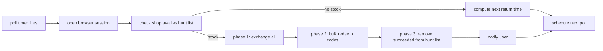

# Hunt Mode Lifecycle

> Background polling loop that watches the HoYoLab shop for items in the user's hunt
> list and triggers a purchase + redeem cycle the moment stock appears. Runs on its
> own schedule, separate from the main [[Daily Task Cycle]].

## Source

- `backend/handlers/HuntModeHandler.py` — `run_hunt()` orchestration
- `backend/handlers/ShoppingHandler.py` — invoked when stock is detected

## How it works

Three-phase execution is intentional — it ensures every redemption code is collected
*before* any cleanup side-effect runs, so a partial failure during exchange doesn't
leave codes uncollected. See [[Three-Phase Hunt Execution Pattern]].

Polling cadence is derived from HoYoLab's posted shop reset clock; [[StringUtil]]
parses `mm/dd` strings to compute return times.

## Depends on

- [[HuntModeHandler]] — the orchestrator
- [[ShoppingHandler]] — performs the actual exchange
- [[RedeemAutofill]] — pastes codes into the redemption form
- [[StringUtil]] — return-time calculation
- [[Browser Session Lifecycle]] — opens its own session per poll
- [[Three-Phase Hunt Execution Pattern]]

## Used by

- [[Daily Task Cycle]] — can also trigger hunt at end of scheduled run

## Gotchas

- Hunt mode can run while the main schedule is paused; gating is per-handler.
- If the Tauri shell is closed, the scheduler stops — hunt polls don't survive shutdown unless autostart is on. See [[Autostart Reconciliation]].

## See also

- [[_index]]
- [[Three-Phase Hunt Execution Pattern]]
- [[HuntModeHandler]]
- [[Daily Task Cycle]]
