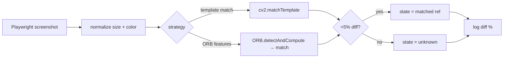

# Image Recognition Pipeline

> Every UI state decision uses OpenCV template matching against reference PNGs in
> `sample/` and `reward image/`, not CSS selectors. Threshold: <5% pixel diff = match.
> This is the project's defense against HoYoLab's volatile DOM.

## Source

- `backend/automation/ImageProcessor.py` — `compare_images()`, `find_correct_avatar()`, `detect_reward()`
- `backend/strategies/ImageComparisonStrategy.py` — pluggable strategy ABC
- `sample/`, `reward image/` — reference PNG library

## How it works

Reference images live next to the code (bundled at build time via
[[PyInstaller Sidecar Build]]). The processor maintains an HTTP session pool for
image fetches with retry semantics. Strategy selection lets future contributors swap
in feature-based detection without touching call sites — see
[[Image Comparison State Detection Pattern]].

## Depends on

- [[ImageProcessor]] — comparison runtime
- [[Image Comparison Strategy]] — pluggable algorithm
- [[OpenCV]] — core
- [[Constants]] — image diff threshold lives here

## Used by

- [[MissionHandler]] — avatar identification, button state
- [[DrawHandler]] — reward detection from prize draws
- [[ShoppingHandler]] — item availability state

## Gotchas

- DPI / scaling differences between Playwright Firefox and reference captures will inflate diff %. Re-capture references after a major HoYoLab redesign.
- Always log the diff % for traceability — pure pass/fail loses the signal needed to tune thresholds.

## See also

- [[_index]]
- [[Image Comparison State Detection Pattern]]
- [[ImageProcessor]]
- [[OpenCV]]
