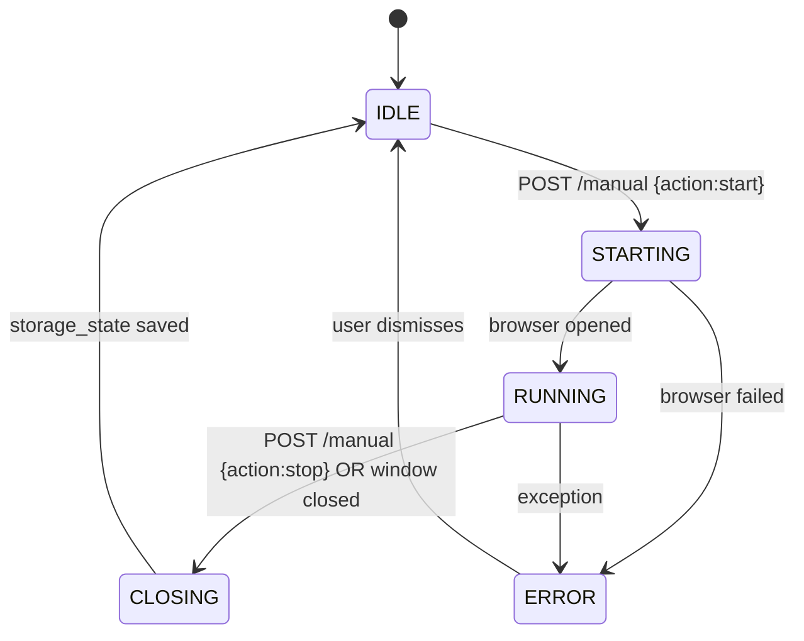

# Manual Login Flow

> When auto-login fails (captcha, account change, expired session), the user opens a
> visible browser via the Manual Login page. A thread-safe state machine in
> `ManualLoginManager` coordinates lifecycle between the frontend, the backend
> handler, and the Playwright browser.

## Source

- `backend/core/ManualLogin.py` — `SessionState` enum + `ManualLoginManager` singleton
- `frontend/src/pages/ManualLogin.jsx` — UI
- `backend/api/routes.py` — `/manual` POST endpoint

## How it works

Frontend polls `/manual` for state; transitions trigger UI changes (button enable,
status text). The backend serializes state transitions through a thread lock — two
concurrent start requests can't double-spawn the browser.

## Depends on

- [[ManualLoginManager]] — state machine
- [[Account Endpoints]] — `/manual` POST
- [[Manual Login Page]] — UI
- [[Storage State Store]] — persists the resulting session

## Used by

- [[Browser Session Lifecycle]] — consumes the storage state produced here
- [[RedeemAutofill]] — emits a Sentry notification when manual login is needed

## Gotchas

- Closing the visible browser window directly (not via the Stop button) still triggers `CLOSING` via Playwright's `close` event — both paths must save storage state.
- If state stays in `STARTING` >30s, the frontend treats it as `ERROR` and offers a retry. The backend timeout is shorter than the frontend display timeout on purpose.

## See also

- [[_index]]
- [[ManualLoginManager]]
- [[Browser Session Lifecycle]]
- [[Manual Login Page]]
