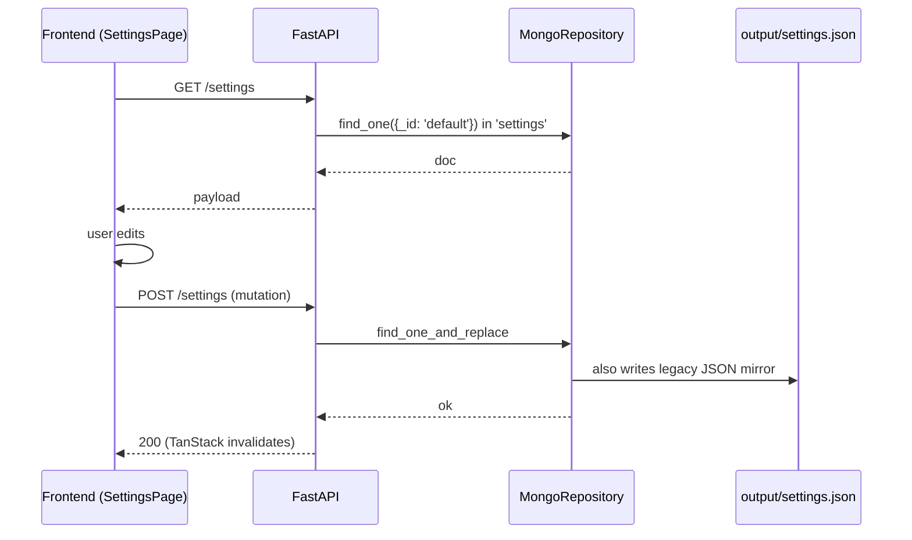

# Settings Persistence Flow

> Settings live in MongoDB (single-doc per category) and are also surfaced as
> `output/settings.json` for legacy compatibility and easy human inspection. The
> frontend reads via `/settings`; the Tauri shell also reads a subset directly to
> bootstrap window state before the backend is ready.

## Source

- `backend/repositories/MongoRepository.py` — `_SINGLE_DOC_COLLECTIONS` includes settings/account/shopping
- `backend/api/routes.py` — `/settings`, `/settings/advanced`
- `frontend/src/services/DataLoader.jsx` — query/mutation per route
- `output/settings.json` — legacy/inspection mirror

## How it works

The legacy JSON mirror survives even if MongoDB is unavailable — the Tauri shell
reads `output/settings.json` directly to recover `autostart_on_login` and window
geometry without waiting for the sidecar to start.

## Depends on

- [[MongoRepository]] — primary store
- [[Settings Endpoints]] — REST layer
- [[DataLoader]] — frontend cache
- [[Settings Page]] — UI
- [[ValueAdapter]] — dynamic form

## Used by

- [[Daily Task Cycle]] — reads `schedule_times`, `hide_browser`, `exit_after_run`
- [[Tauri Shell Entry]] — reads `autostart_on_login`, window geometry
- [[ThemeContext]] — reads persisted `theme` on mount

## Gotchas

- Two writers: MongoDB and the Tauri shell's local `window-state.json`. See [[Window State Dual Storage]] for the merge rule.
- Adding a new persisted field also requires updating [[Settings Contract]] if it's an "advanced" setting.

## See also

- [[_index]]
- [[MongoRepository]]
- [[Settings Endpoints]]
- [[Window State Dual Storage]]
