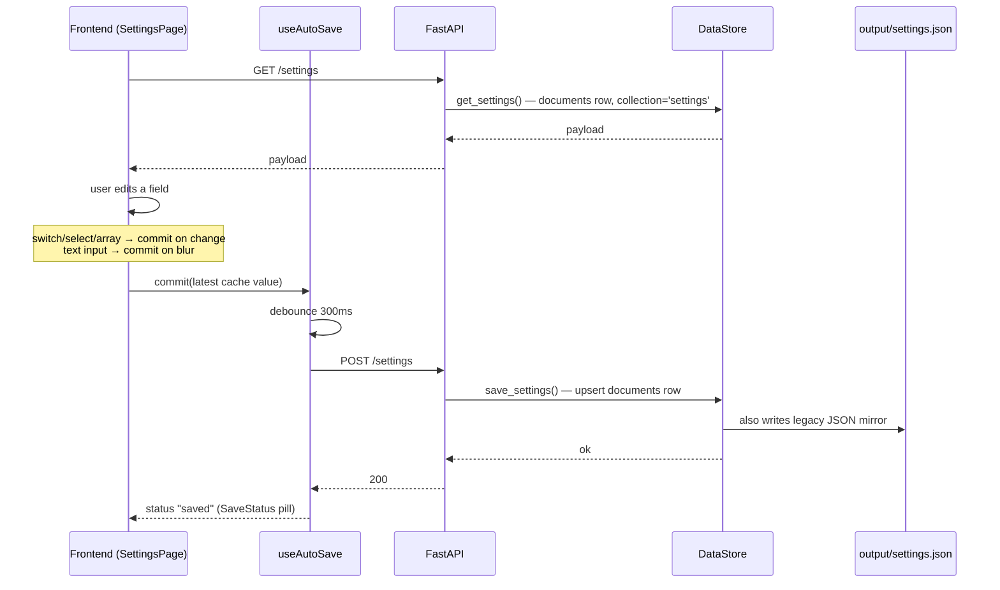

# Settings Persistence Flow

> Settings live in the embedded SQLite database (one row in the `documents` table,
> `collection='settings'`) and are also surfaced as `output/settings.json` for legacy
> compatibility and easy human inspection. The frontend reads via `/settings`; the
> Tauri shell also reads a subset directly to bootstrap window state before the
> backend is ready.

## Source

- `backend/repositories/DataStore.py` — `_SINGLE_DOC_COLLECTIONS` includes settings/account/shopping
- `backend/api/routes.py` — `/settings`, `/settings/advanced`
- `frontend/src/services/DataLoader.jsx` — query/mutation per route
- `output/settings.json` — legacy/inspection mirror

## How it works

The frontend has no submit button — [[useAutoSave]] fires the mutation
automatically when the user blurs a text field or flips a switch/select/array
control. The legacy JSON mirror lets the Tauri shell read `output/settings.json`
directly to recover `autostart_on_login` and window geometry without waiting
for the sidecar to start. SQLite is an embedded file, so there is no connection
to lose and no runtime-reconnect step — a settings save never has to reconcile
a database URI.

## Depends on

- [[DataStore]] — primary store
- [[Settings Endpoints]] — REST layer
- [[DataLoader]] — frontend cache
- [[useAutoSave]] — debounced commit + status
- [[Settings Page]] — UI
- [[ValueAdapter]] — dynamic form

## Used by

- [[Daily Task Cycle]] — reads `schedule_times`, `hide_browser`, `exit_after_run`
- [[Tauri Shell Entry]] — reads `autostart_on_login`, window geometry
- [[ThemeContext]] — reads persisted `theme` on mount

## Gotchas

- Two writers: the SQLite `documents` table and the Tauri shell's local `window-state.json`. See [[Window State Dual Storage]] for the merge rule.
- Adding a new persisted field also requires updating [[Settings Contract]] if it's an "advanced" setting.

## See also

- [[_index]]
- [[DataStore]]
- [[Settings Endpoints]]
- [[Window State Dual Storage]]
