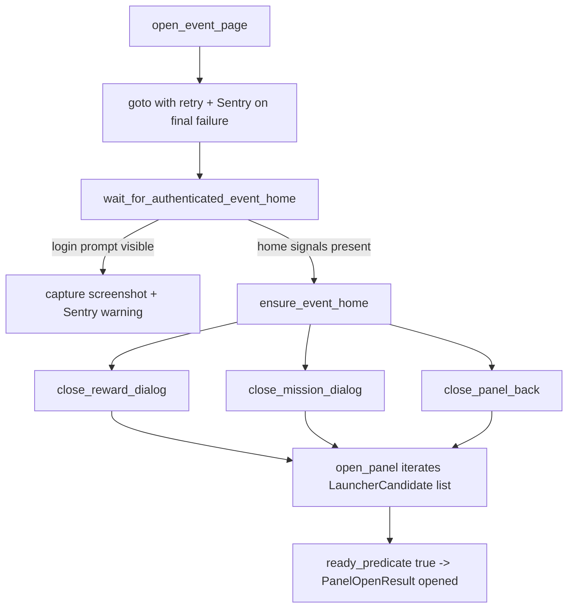

# EventNavigator

> Shared HoYoLab event page helpers — open the event URL, validate auth, dismiss blocking modals, and open feature panels with bounded retries.

## Source
- `backend/automation/EventNavigator.py` — primary

## How it works

`PanelOpenResult` and `EventPageAuthResult` dataclasses make outcomes inspectable by handlers. `is_locator_visible()` also feeds [[Tracking Helpers]] so every visibility probe shows up in [[LocatorTracker]].

## Depends on
- [[Selectors]] — dialog close + panel back targets
- [[Tracking Helpers]] — `safe_track_locator` visibility hits
- [[Constants]] — event URL, retries, timeouts
- [[Screenshot Store]] — capture on auth/navigation failure

## Used by
- [[MissionHandler]], [[ShoppingHandler]], [[DrawHandler]], [[HuntModeHandler]]

## Gotchas
- Auth check requires both home content visible AND login controls absent — relying on home signals alone misclassifies guest sessions.
- Panel back close races: the helper retries with `force=True` before giving up.

## See also
- [[_index]]
- [[Browser Session Lifecycle]]
- [[Manual Login Flow]]
