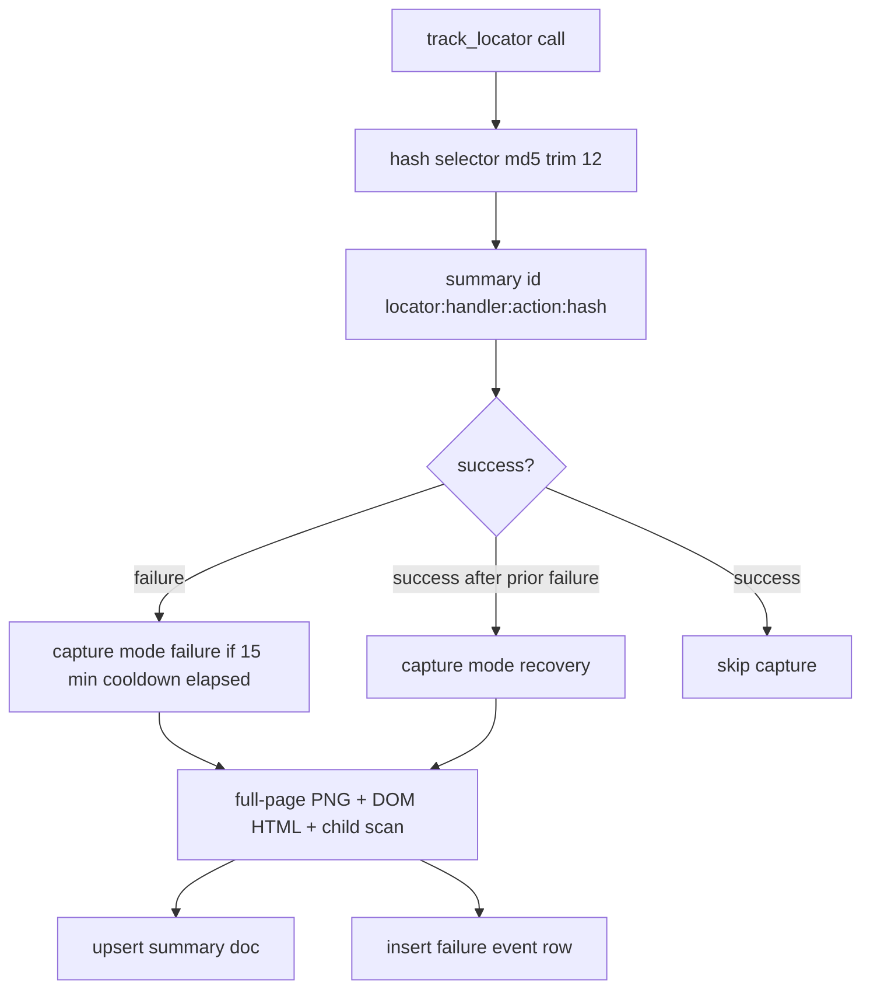

# LocatorTracker

> Per-selector telemetry that captures screenshots, DOM snapshots, and rolling failure events for every Playwright interaction.

## Source
- `backend/automation/LocatorTracker.py` — primary

## How it works

Summary docs live in `locator_tracker` (7-day TTL); failure events live in `locator_tracker_failures`. Element-level crops are saved when the `Locator` argument is visible; the JS-driven child scan crops up to six visible boxes from the full-page screenshot.

## Depends on
- [[MongoRepository]] — upsert + failure event writes
- [[Screenshot Store]] — binary asset persistence with TTL metadata
- [[Playwright]] — locator + page APIs

## Used by
- [[Tracking Helpers]] — `safe_track` wrapper
- [[EventNavigator]], [[RetryHelper]], [[MissionHandler]], [[ShoppingHandler]], [[DrawHandler]], [[HuntModeHandler]]
- [[Locator Tracker Endpoints]] — read/clear API

## Gotchas
- `_FAILURE_CAPTURE_COOLDOWN_SECONDS = 15 * 60` throttles redundant artefact saves per summary id.
- Bumping `LOCATOR_TRACKER_SCHEMA_MARKER` wipes existing diagnostics on next start.

## See also
- [[_index]]
- [[Locator Telemetry Pipeline]]
- [[Locator Tracker Instrumentation Pattern]]
