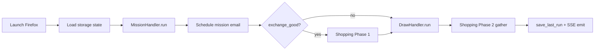

# Bot Entry Point

> Process entry that boots logging, Sentry, scheduler, FastAPI server, and (in dev) the Vite frontend, then orchestrates the full automation workflow.

## Source

- `backend/Bot.py` — primary implementation

## How it works

`__main__` parses `--port` (default **8001**), `--no-frontend`, and `--hosted-by-tauri`, then loads env, configures logging (file-only when packaged), initializes [[GlobalVar]] runtime state, configures Sentry, optionally launches the Vite dev server, starts the `schedule`-driven thread, and runs Uvicorn.

`playwright_task()` is the orchestrator — guarded by a `threading.Lock` so manual triggers cannot stack.

## Depends on

- [[GlobalVar]] — settings, CONFIG, FastAPI app, `is_exe`
- [[MissionHandler]], [[ShoppingHandler]], [[DrawHandler]], [[HuntModeHandler]] — pipeline stages
- [[Mission Email Scheduler]] — async/sync email dispatch
- [[Event Bus]] — emits `task-completed` SSE event
- [[Schedule]] — daily and hunt cron-like triggers

## Used by

- [[Sidecar Spawn]] — Tauri shell launches this as a subprocess
- [[Bot Dev Run]] — `uv run python backend/Bot.py`

## Gotchas

- Dev port 8001 vs production sidecar port 8000 — frontend env must match.
- Falls back from Firefox to Chromium when the bundled browser binary is missing.
- `--no-frontend` skips Vite spawn; `--hosted-by-tauri` skips StaticFiles mount.

## See also

- [[_index]]
- [[Daily Task Cycle]]
- [[Three-Phase Hunt Execution Pattern]]
