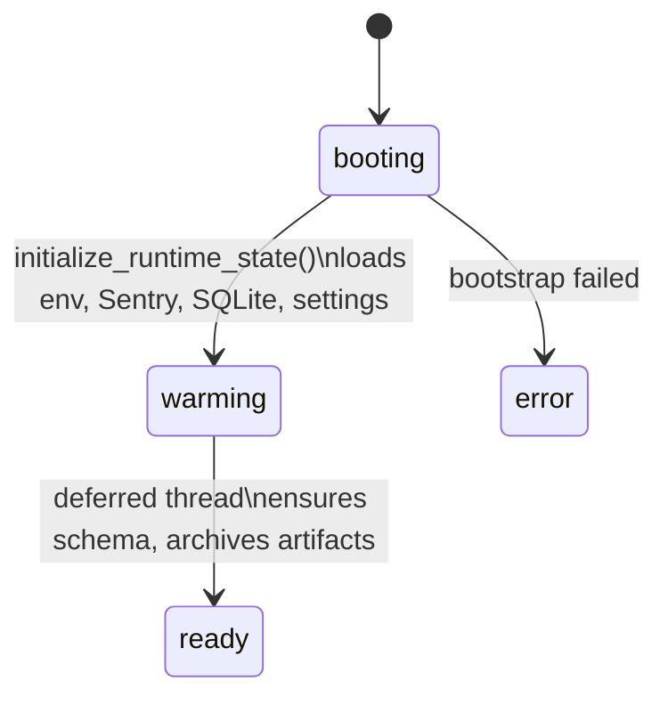

# GlobalVar

> Module-level runtime singleton that owns `CONFIG` paths, the `AppSettings`/`Account` dataclasses, the FastAPI app, and the staged startup state machine.

## Source

- `backend/core/GlobalVar.py` — primary implementation

## How it works

`is_exe` resolves once at import (also honoring `SIMULATE_EXE=1`). `resource_path()` then branches dev vs exe vs SIMULATE_EXE, with `outside_path=True` directing user data alongside the executable (or under the project root in dev) so it survives updates.

`CONFIG` is built by `generate_config()` from a fixed map of relative paths; only entries flagged as outside-folder (storage, output, screenshot) get `outside_path=True`.

Startup runs in three phases:

`AppSettings` holds 30+ fields including schedule, hunt polling, Sentry knobs, theme. `Account` holds HoYo and Gmail credentials. Both are `Serializable` dataclasses persisted in SQLite.

## Depends on

- [[DataStore]] — `get_settings`, `get_account`, `save_settings`
- [[SQLite Connection]] — embedded database file under `data/`
- [[FastAPI]] — `app` instance also serves `/images` and `/screenshot` mounts
- [[Sentry]] — early init when `SENTRY_DSN` is present

## Used by

- [[Bot Entry Point]] — reads `CONFIG`, `settings`, `is_exe`
- Every handler — imports `CONFIG` paths and `settings` flags

## Gotchas

- `SIMULATE_EXE=1` forces exe-style path resolution in dev for testing packaged behavior.
- The SQLite database file is selected by runtime mode (`zzz_bot_dev.db` vs `zzz_bot.db`); there is no configurable connection URI — the old `mongodb_uri` setting field is gone.
- Account loading is lazy via `ensure_accounts_loaded()` to avoid a database dependency at import time.

## See also

- [[_index]]
- [[Resource Path Resolution Pattern]]
- [[Settings Persistence Flow]]
