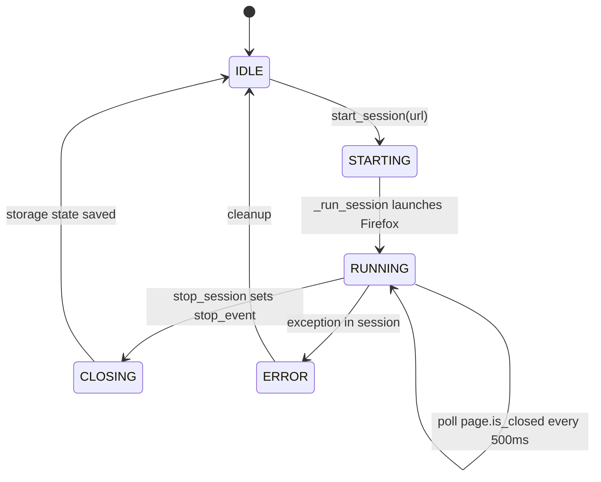

# ManualLoginManager

> Thread-safe singleton that runs a visible Playwright Firefox session so the user can sign in to HoYoLab manually; persists storage state to Mongo when the browser closes.

## Source

- `backend/core/ManualLogin.py` — primary implementation

## How it works

`SessionState` enum tracks five phases: `IDLE → STARTING → RUNNING → CLOSING/ERROR → IDLE`.

URL validation only allows `hoyolab.com`, `hoyoverse.com`, `mihoyo.com` netlocs (warning, not block). The polling loop detects manual browser close by catching `page.is_closed()` or any exception on `page.title()`. After save, the legacy local storage-state file is deleted so MongoDB becomes the single source of truth.

## Depends on

- [[GlobalVar]] — `CONFIG["STORAGE_PATH"]`, icons
- [[Storage State Store]] — `save_context_storage_state(write_local_backup=False)`
- [[NotificationHelper]] — desktop notifications on start/save
- [[Playwright]] — Firefox always headful for this flow

## Used by

- [[Manual Login Page]] — REST endpoints call `start_session` / `stop_session`
- [[Automation Endpoints]] — exposes session state

## Gotchas

- Singleton pattern uses double-checked locking; `__init__` short-circuits on re-construction.
- After save the local storage state file is **removed**, not just overwritten.

## See also

- [[_index]]
- [[Manual Login Flow]]
