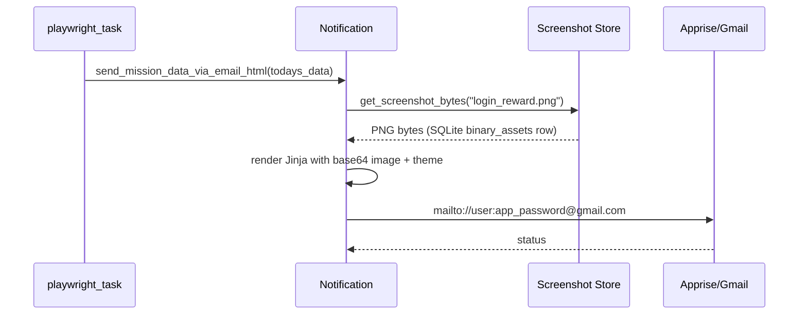

# Notification Sender

> Renders the daily mission Jinja template with an embedded base64 login screenshot and delivers it as an HTML email through Apprise/Gmail SMTP.

## Source

- `backend/core/Notification.py` — primary implementation

## How it works

`send_mission_data_via_email_html(todays_data)` is wrapped in a Sentry span and short-circuits if `todays_data["day"]` is not today.

Falls back to the legacy `SCREENSHOT_FOLDER/login_reward.png` path if the database asset is missing. `send_mail()` calls `ensure_accounts_loaded()` so credentials are lazily fetched.

## Depends on

- [[GlobalVar]] — `CONFIG["MISSION_NOTIFICATION"]`, `accounts`, `settings.theme`
- [[Screenshot Store]] — SQLite-backed image retrieval
- [[Jinja2]] — template rendering
- [[Apprise]] — SMTP delivery
- [[Mission Email Template]] — the HTML template

## Used by

- [[Mission Email Scheduler]] — `_send_mission_email` wrapper passes the payload
- [[Bot Entry Point]] — via the scheduler

## Gotchas

- App password (not Gmail login password) is required; stored in `accounts.app_password`.
- Silent return when the date does not match prevents stale emails after midnight runs.

## See also

- [[_index]]
- [[Notification Pipeline]]
