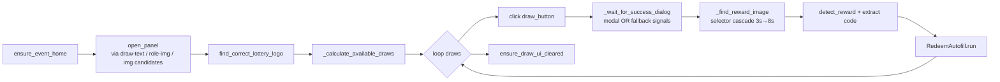

# DrawHandler

> Prize draw automation: opens the lottery panel, calculates available draws from points/cost/limit, performs each draw, detects the reward image, and forwards codes to autofill.

## Source

- `backend/handlers/DrawHandler.py` — primary implementation

## How it works

`_calculate_available_draws` takes `min(points // cost, remaining)` — `is_enabled()` is unreliable because the button stays enabled even when nothing is left. Result dialog detection accepts the modal selector OR a fallback signal (reward image, code image, redeem code element, close button), since the success copy has drifted historically.

Failures save a screenshot to MongoDB plus a DOM snapshot to `logs/errors/` and emit a structured Sentry message tagged `draw.issue=missing_result_dialog`.

## Depends on

- [[EventNavigator]] — panel open/close
- [[RedeemAutofill]] — code redemption
- [[ImageProcessor]] — `find_correct_lottery_logo`, `detect_reward`
- [[StringUtil]] — `extract_price`, `extract_number`
- [[Screenshot Store]] — failure diagnostics

## Used by

- [[Bot Entry Point]] — runs between shopping phases when `settings.draw_item`

## Gotchas

- First-draw failure usually means stale UI counts; handler logs both pre- and post-recheck values for triage.
- `close_draw_screen` must succeed so the next handler starts from event home.

## See also

- [[_index]]
- [[Daily Task Cycle]]
- [[Image Recognition Pipeline]]
