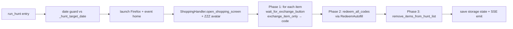

# HuntModeHandler

> Time-targeted purchase handler — at the scheduled hunt window it launches its own browser, waits for each item's button to flip to `Exchange`, exchanges all of them, then redeems the codes in bulk.

## Source

- `backend/handlers/HuntModeHandler.py` — primary implementation

## How it works

Three-phase pattern that decouples side effects so a partial failure doesn't strand state.

`wait_for_exchange_button` polls the item button text with optional exponential backoff (`hunt_poll_backoff_enabled`) and early exit on `limit reached`/`sold out`/`unavailable` tokens. `WAIT_BUFFER_SECONDS = 120` is consumed by [[Bot Entry Point]] to schedule the run 2 minutes early.

## Depends on

- [[ShoppingHandler]] — open shopping, select avatar, `handle_exchange_dialog`
- [[EventNavigator]] — auth check, navigation
- [[RedeemAutofill]] — bulk redemption in Phase 2
- [[Selectors]] — `SHOPPING_ITEM`, `SHOPPING_ITEM_BUTTON`
- [[DataHandler]] — `load_shopping_data`, `save_shopping_data`
- [[Storage State Store]] — saves auth after run

## Used by

- [[Bot Entry Point]] — `schedule_hunt_tasks()` registers `run_hunt` via the `schedule` library
- [[Overview Page]] — reads `get_next_hunt_time()` for the countdown UI

## Gotchas

- Date guard: `schedule` fires daily but `_hunt_target_date` ensures the run only proceeds on the target day.
- Spawns its **own** Playwright session — does not reuse the daily-task browser.
- Settings re-check happens inside `run_hunt` so disabling automation mid-day cancels a queued fire.

## See also

- [[_index]]
- [[Hunt Mode Lifecycle]]
- [[Three-Phase Hunt Execution Pattern]]
