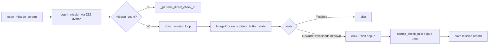

# MissionHandler

> Daily check-in and mission completion handler — counts available missions, clicks each, and handles the check-in popup that opens in a side page.

## Source

- `backend/handlers/MissionHandler.py` — primary implementation

## How it works

`Mission.attach_page_listener` queues popups so they are processed outside the Playwright event callback (avoids sync-API reentrancy). `handle_check_in()` polls for the success dialog, login modal, or active day button — auth-required outcomes raise a dedicated Sentry warning and persist a diagnostic screenshot.

## Depends on

- [[ImageProcessor]] — `detect_button_state`, `find_correct_avatar`
- [[RetryHelper]] — `retry_until_screen_appears`, `retry_until_non_zero_count`
- [[Tracking Helpers]] — `safe_track` on every locator interaction
- [[DataHandler]] — `maintain_mission_data` persists daily report
- [[Screenshot Store]] — saves login reward + failure diagnostics

## Used by

- [[Bot Entry Point]] — `Mission.run(...)` is the first pipeline stage
- [[Mission Endpoints]] — reads persisted reports

## Gotchas

- Popup listener **must be detached** before [[ShoppingHandler]] runs — popups in shopping would otherwise be re-queued here.
- `handle_check_in` writes both `check_in` and an optional `check_in_detail` (e.g. `"auth_required"`).

## See also

- [[_index]]
- [[Daily Task Cycle]]
- [[Handler Run Pattern]]
