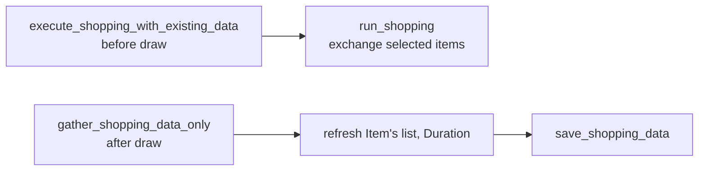

# ShoppingHandler

> Gathers shop inventory and pricing, exchanges selected items for redemption codes, and forwards the codes to autofill on the redemption page.

## Source

- `backend/handlers/ShoppingHandler.py` — primary implementation

## How it works

Split across two callable entry points so the daily cycle can run shopping twice:

Each path opens the shopping panel via [[EventNavigator]] launcher candidates, selects the ZZZ avatar (with 3 retries that force-reopen the panel), then either runs exchanges or gathers data. `gather_data()` walks every visible item, parsing price, inventory, and either the `Exchange`/`Limit Reached` label or a `HH:MM:SS` countdown converted to a return time.

`run_shopping()` honors `settings.buy_all` (else only the first selected item), `settings.stop_on_failed_exchange` (with already-purchased items exempt), then calls `RedeemAutofill.run` and finally `HuntMode.remove_items_from_hunt_list` on success.

## Depends on

- [[EventNavigator]] — panel open/close primitives
- [[RedeemAutofill]] — code redemption side-flow
- [[ImageProcessor]] — `find_correct_avatar`
- [[Selectors]] — all `SHOPPING_*` selectors
- [[DataHandler]] — `load_shopping_data` / `save_shopping_data`
- [[HuntModeHandler]] — cleanup callback after successful exchange

## Used by

- [[Bot Entry Point]] — two-phase invocation around the draw
- [[HuntModeHandler]] — reuses `open_shopping_screen`, `select_zzz_avatar`, `handle_exchange_dialog`

## Gotchas

- `_extract_current_points` must be called **after** the ZZZ avatar is selected — otherwise it reads `0`.
- The `Purchased` list is merged (union) on each gather to preserve history across runs.

## See also

- [[_index]]
- [[Daily Task Cycle]]
- [[Handler Run Pattern]]
