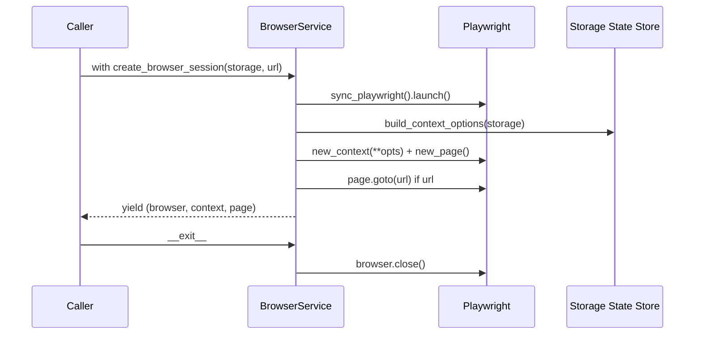

# BrowserService

> Reusable browser-lifecycle service that exposes a `create_browser_session` context manager plus static helpers (click, wait, screenshot, overlay-close) for non-handler automation code.

## Source

- `backend/services/BrowserService.py` — primary implementation

## How it works

Instantiated with `headless` and `browser_type` ("firefox" by default), then used as a context manager:

Storage state is loaded via [[Storage State Store]] so the SQLite `binary_assets` table is consulted first with a JSON file fallback. `save_session_state()` writes through the same helper. Static helpers (`click_element`, `wait_for_element`, `close_overlay`, `take_screenshot`) wrap their Playwright counterparts with logging and exception suppression.

## Depends on

- [[Playwright]] — sync API
- [[Storage State Store]] — `build_context_options`, `load_storage_state`, `save_context_storage_state`
- [[Screenshot Store]] — `save_page_screenshot`

## Used by

- *(Not currently used by the main automation flow — handlers each manage their own Playwright contexts directly; this service exists for ad-hoc tasks and to embody dependency-inversion in the codebase.)*

## Gotchas

- The main automation in [[Bot Entry Point]] does **not** route through this service; expect divergence between the two paths.
- `take_screenshot` ignores the on-disk `path` and saves to the SQLite `binary_assets` table instead, keying by `basename(path)`.

## See also

- [[_index]]
- [[Browser Session Lifecycle]]
