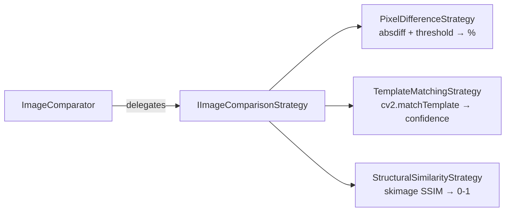

# Image Comparison Strategy

> Strategy-pattern interface (`IImageComparisonStrategy`) with three swappable implementations — pixel difference, OpenCV template matching, and SSIM — used by the image recognition pipeline to detect UI states and rewards.

## Source

- `backend/strategies/ImageComparisonStrategy.py` — primary implementation

## How it works

- **PixelDifferenceStrategy** (default): resizes images to match, `cv2.absdiff` → grayscale → binary threshold (`IMAGE_BINARY_THRESHOLD = 30`), returns non-zero pixel %. `is_match` defaults to `IMAGE_MATCH_THRESHOLD = 5.0`.
- **TemplateMatchingStrategy**: `cv2.matchTemplate` with configurable method (default `TM_CCOEFF_NORMED`); default match threshold `0.8`.
- **StructuralSimilarityStrategy**: lazy-imports `skimage.metrics.structural_similarity`; default threshold `0.95`.

`ImageComparator` is the context object; `set_strategy()` swaps implementations at runtime. `load_image()` accepts either a filesystem path or an existing numpy array.

## Depends on

- [[OpenCV]] — `cv2.imread`, `absdiff`, `matchTemplate`, `threshold`, `cvtColor`, `resize`
- [[Constants]] — `IMAGE_MATCH_THRESHOLD`, `IMAGE_BINARY_THRESHOLD`

## Used by

- [[ImageProcessor]] — composes a strategy for button-state and reward detection

## Gotchas

- SSIM raises `ImportError` at construction if `scikit-image` is missing (not a runtime crash, but degrades gracefully when unused).
- Mismatched shapes are silently resized to image-1 dimensions — beware comparing tiny templates to full screenshots with PixelDifference.

## See also

- [[_index]]
- [[Image Recognition Pipeline]]
- [[Image Comparison State Detection Pattern]]
