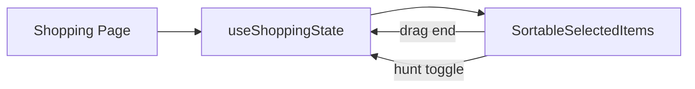

# SortableSelectedItems

> Drag-to-reorder list of selected shopping items with a per-row hunt-mode checkbox.

## How it works
Wraps a `DndContext` (PointerSensor with 5px activation distance + KeyboardSensor) around a `SortableContext` using `verticalListSortingStrategy`. Each row is a `SortableItem` (MUI `Paper`) with a `DragIndicatorIcon` drag handle, a 1-based priority badge, the item name, and a `Checkbox` bound to `huntItems` via `onHuntToggle`. Dragging lifts elevation to 4, applies `GLOW.strong`, and bumps z-index. Item identity is `item.Name` (so names must be unique). The whole component returns `null` when `selectedRows` is empty.

## Source
- `frontend/src/components/common/SortableSelectedItems.jsx` — primary

## Depends on
- [[DnD Kit]] — `@dnd-kit/core`, `/sortable`, `/utilities`
- [[ThemeContext]] — themeColors
- [[Theme Styles]] — `GLOW.strong`
- [[useShoppingState]] — `onDragEnd`, `onHuntToggle`

## Used by
- [[Shopping Page]] — priority + hunt selection panel

## Gotchas
- Sortable IDs are `item.Name`; duplicate names break drag identity.

## See also
- [[_index]]
- [[Shopping Page]]
