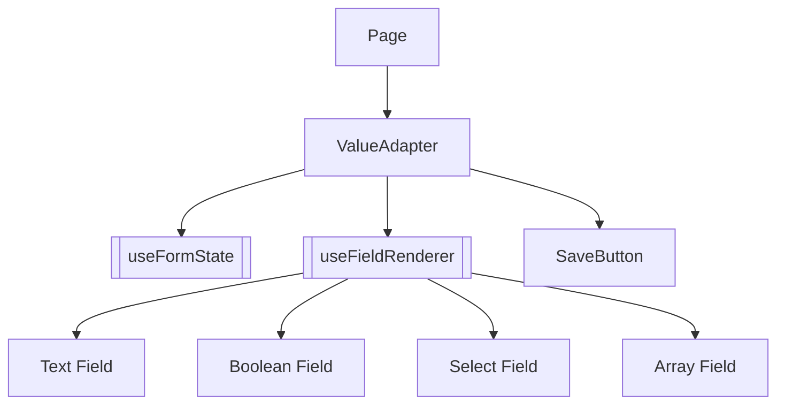

# ValueAdapter

> The central dynamic-form generator: turns a backend JSON document into themed, typed inputs.

## How it works
Loads form state via [[useFormState]] (`value`, `error`, `handleChange`, `handleSubmit`, `alert`, `setAlert`) keyed by `route`. Field rendering is delegated to [[useFieldRenderer]], which inspects each key/value to pick [[Text Field]], [[Boolean Field]], [[Select Field]], or [[Array Field]] (plus `typeConfig[key]` overrides for labels and select options). Layout has two modes: `customSections` (a static map or a function of `value` returning `{sectionKey: {fields, icon}}`) renders grouped sections with header icons and dividers; otherwise standalone keys of `value` render in a flat list. `customIcons[fieldKey]` adds an icon to a row label. `extraActions` produces outlined buttons rendered in a row above the [[SaveButton]] — each async `onClick` toggles per-key loading state and surfaces success/error through the snackbar.

## Source
- `frontend/src/components/forms/ValueAdapter.jsx` — primary

## Depends on
- [[useFormState]], [[useFieldRenderer]]
- [[SaveButton]]
- [[ThemeContext]], [[Color Re-exports]]
- [[Dynamic Form ValueAdapter Pattern]]

## Used by
- [[Shopping Page]], [[Account Page]], [[Settings Page]], [[Redeem Page]] — backend-shaped forms

## See also
- [[_index]]
- [[Dynamic Form ValueAdapter Pattern]]
- [[Frontend Data Flow]]
