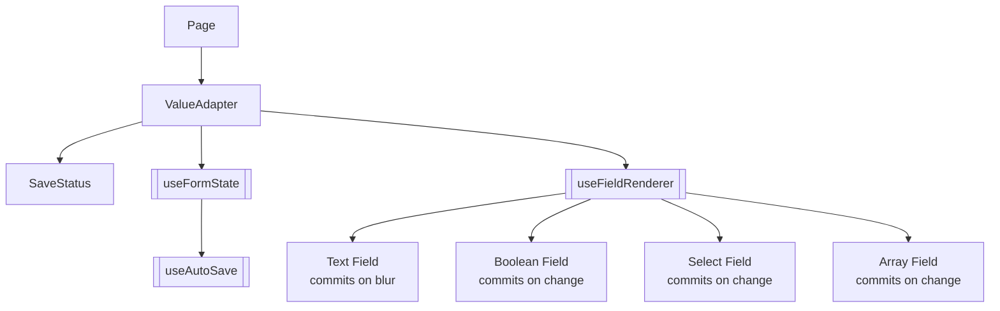

# ValueAdapter

> The central dynamic-form generator: turns a backend JSON document into themed, typed inputs with auto-save.

## How it works
Loads form state via [[useFormState]] (`value`, `error`, `handleChange`, `commit`, `autoSave`) keyed by `route`. Field rendering is delegated to [[useFieldRenderer]], which inspects each key/value to pick [[Text Field]], [[Boolean Field]], [[Select Field]], or [[Array Field]] (plus `typeConfig[key]` overrides for labels and select options). Edits write optimistically to the TanStack cache via `handleChange` and persist through `commit` — discrete controls (switch/select/array) commit immediately after `onChange`, text inputs commit on blur. There is no submit button. A [[SaveStatus]] pill mounted at the top right of the form surfaces `autoSave.status` (saving / saved / error) and offers Retry on failure.

Layout has two modes: `customSections` (a static map or a function of `value` returning `{sectionKey: {fields, icon}}`) renders grouped sections with header icons and dividers; otherwise standalone keys of `value` render in a flat list. `customIcons[fieldKey]` adds an icon to a row label. `extraActions` produces outlined buttons rendered in a row at the bottom — each async `onClick` toggles per-key loading state and surfaces success/error through a bottom-center snackbar (unrelated to the save flow).

## Source
- `frontend/src/components/forms/ValueAdapter.jsx` — primary

## Depends on
- [[useFormState]], [[useFieldRenderer]]
- [[SaveStatus]], [[useAutoSave]]
- [[ThemeContext]], [[Color Re-exports]]
- [[Dynamic Form ValueAdapter Pattern]]

## Used by
- [[Account Page]], [[Settings Page]] — backend-shaped forms

## See also
- [[_index]]
- [[Dynamic Form ValueAdapter Pattern]]
- [[Frontend Data Flow]]
