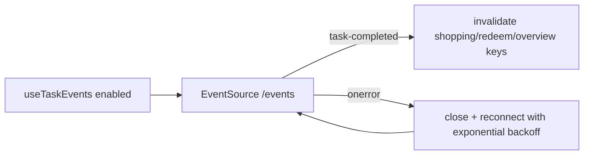

# useTaskEvents

> SSE listener that invalidates task-related query caches whenever the backend fires a `task-completed` event.

## Source
- `frontend/src/hooks/useTaskEvents.js` — primary

## How it works

1. Opens `EventSource(${BACKEND_URL}/events)` only when `enabled: true` (gated on backend health in [[PermanentDrawer Router]]).
2. On `task-completed`, parses JSON payload and invalidates `shopping`, `redeem`, `overview/mission`, `overview/hunt`, `check-run-status` query keys.
3. Reconnects with exponential backoff (1s → 30s cap), resetting the delay on each successful `onopen`.
4. Cleanup closes the connection and clears any pending reconnect timer.

## Depends on
- [[Health Endpoints]] — `/events` SSE stream
- [[Event Bus]] — backend publisher
- [[TanStack Query]] — `invalidateQueries`
- [[Frontend Constants]] — `BACKEND_URL`

## Used by
- [[PermanentDrawer Router]] — mounts once at the layout level

## See also
- [[_index]]
- [[SSE Event Bus Pattern]]
- [[Frontend Data Flow]]
