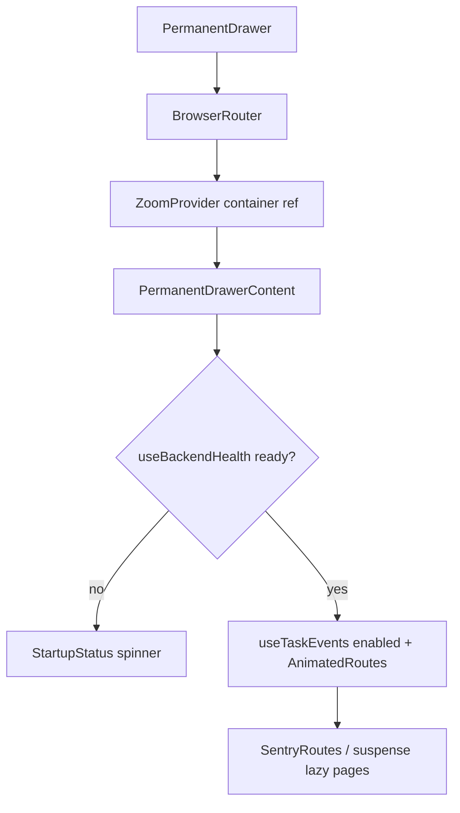

# PermanentDrawer Router

> Root layout: BrowserRouter + ZoomProvider + AuroraBackground + AppHeader + NavigationDrawer with animated, health-gated route content.

## Source
- `frontend/src/routes/PermanentDrawer.jsx` — primary

## How it works

1. Outer `PermanentDrawer` mounts `BrowserRouter` + [[useZoom]] provider with a container ref (for Ctrl+wheel).
2. `PermanentDrawerContent` probes [[DataLoader]] `useBackendHealth`, enables [[useTaskEvents]] only after `ready`, and either renders `StartupStatus` or `AnimatedRoutes`.
3. `SentryRoutes = Sentry.withSentryReactRouterV7Routing(Routes)` enables route tracing.
4. Routes: `/` Overview (eager), `/shopping`, `/account`, `/settings`, `/tools` (`React.lazy` + `Suspense`). Catch-all `*` redirects to `/settings`.
5. `useTransitionDirection` compares the previous and current index in `ROUTE_ORDER = ["/", "/shopping", "/account", "/settings", "/tools"]` to pick slide direction (1 forward / -1 back) for `directionalPageVariants`.
6. Layout wraps `<main>` in a scaled `100dvh/zoomLevel` box and applies CSS `zoom`.

## Depends on
- [[React Router]], [[Framer Motion]], [[MUI]], [[Sentry]]
- [[DataLoader]], [[useTaskEvents]], [[useZoom]], [[ThemeContext]]
- [[AppHeader]], [[NavigationDrawer]], [[AuroraBackground]]

## Used by
- [[Frontend Entry Point]] — top-level mount

## See also
- [[_index]]
- [[Frontend Data Flow]]
- [[Sidecar Lifecycle]]
